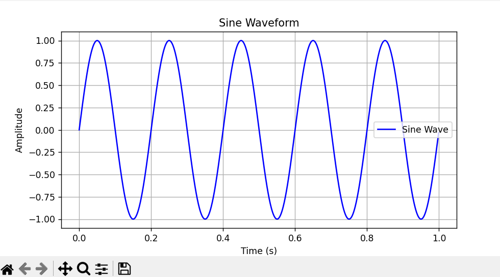

README.md for Python Waveform Generator
markdown
Copy
Edit
# 🎵 Python Waveform Generator

A simple Python project to generate and visualize waveforms like **sine, square, and triangle waves**.

## 🚀 Features
✔ Generate **Sine, Square, and Triangle** waves  
✔ Adjustable **frequency and amplitude**  
✔ Plot waveforms using **Matplotlib**  
✔ **Tested** with `pytest`  


## 🛠️ Installation

1️⃣ **Clone the Repository**
```bash
git clone https://github.com/yourusername/Python-Waveform-Generator.git
cd Python-Waveform-Generator

2️⃣ Install Dependencies

ip install -e .

Usage
Generate a Waveform
from waveform_generator.generator import generate_waveform

t, y = generate_waveform(wave_type="sine", frequency=5, amplitude=1, duration=1, sample_rate=1000)

Plot a Waveform
from waveform_generator.plotter import plot_waveform

plot_waveform(t, y, wave_type="Sine Wave")


Running Tests
Run all tests using pytest:

pytest

Example Output
Here’s a sample Sine Wave plot:


🤝 Contributing
Feel free to submit issues or contribute via pull requests! 🎉